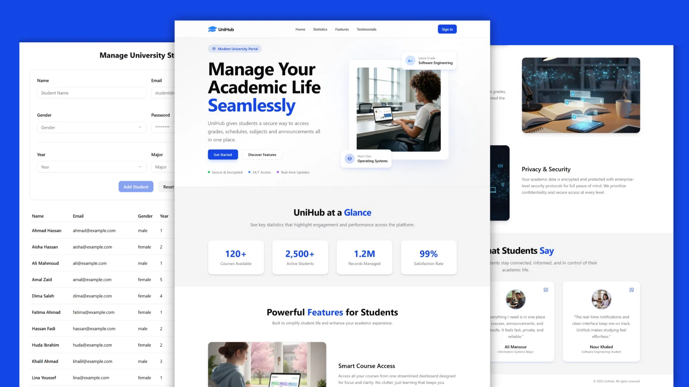

# 🏫 UniHub - Frontend

## 📚 Overview

UniHub is a university management system developed as part of an academic project.
The frontend application provides role-based user interfaces that enable access to subjects, exams, results, and university-related data through a modern web interface.

## 🖼️ Screenshot



## ✨ Features

- Role-based **dashboards** for Students, Professors, and Admins
- **Secure** authentication and session management
- View and **manage** subjects, exams, and results
- **Responsive** UI for desktop and mobile
- Reusable components with Tailwind CSS & **shadcn/ui**
- API integration with backend using **Axios**

## 👥 User Roles

UniHub allows authenticated users to perform actions based on their role:

1. 🛠️ **Admins**

   - Manage student records
   - Manage professor accounts
   - Create, update, and delete subjects

2. 🧑‍🏫 **Professors**

   - View assigned subjects
   - Schedule exam dates and times
   - Publish and manage exam results

3. 🎓 **Students**

   - Access enrolled subjects
   - View exam schedules
   - Review grades and status

## 🧰 Tech Stack

- ⚛️ React
- ⚡ Vite
- 🟨 JavaScript (ES6+)
- 🎨 Tailwind CSS
- 🧩 shadcn/ui
- 🔗 Axios
- 🧭 React Router

## 🗂️ Project Structure

```
src/
├── components/    # Reusable UI components
├── context/       # Authentication global state
├── hooks/         # Custom React hooks
├── lib/           # External libraries or wrappers
├── pages/         # Application pages
├── routes/        # Role-based route protection
├── styles/        # Global CSS & Tailwind configuration
├── utils/         # Helper functions
├── App.jsx        # Main app component
└── main.jsx       # Application entry point
```

## 🔐 Authentication & Security

UniHub implements a **two-layer secure authentication system** to protect the application and ensure users can only access permitted resources.

### 1️⃣ Client-Side

- **Global user context:** `AuthContext` Stores the authenticated user and provides `login()` & `logout()` functions to update the state.

- **Persistent Login:** `/auth/me` endpoint Automatically restores the user session on page refresh using the `withCredentials` option.

- **Role-Based Route Protection:** `AuthGuard` restricts access to routes based on user role, redirecting unauthorized users to `/login` or `NotFound` page.

### 2️⃣ Backend-Side

The backend enforces security with **two middlewares**:

- **`requireAuth` Middleware**

  - Verifies that a valid JWT token is present in the request.
  - Rejects requests from unauthenticated users with a 401 Unauthorized error.

- **`requireRole` Middleware**
  - Ensures the authenticated user has the correct role for the requested action.
  - Rejects users without the required role with a 403 Forbidden error.

## 🚧 Future Improvements

- **Advanced Admin Analytics:** Dashboard charts for student performance, exam statistics, and subject enrollments.
- **Search, Filter & Pagination:** Improve usability for large datasets like students, subjects, and results.
- **Notifications & Alerts:** Real-time notifications for upcoming exams, results, and announcements.
- **Dark Mode:** Optional theme toggle for better usability and accessibility.
- **Multi-Language Support:** Add Arabic and other languages for a more inclusive user experience.

## 👥 Contributors

- Beniamin Hekimian - Frontend Development
- Hamazasb Shakarian - Backend Development
- Apraham Avnian - Backend Development
